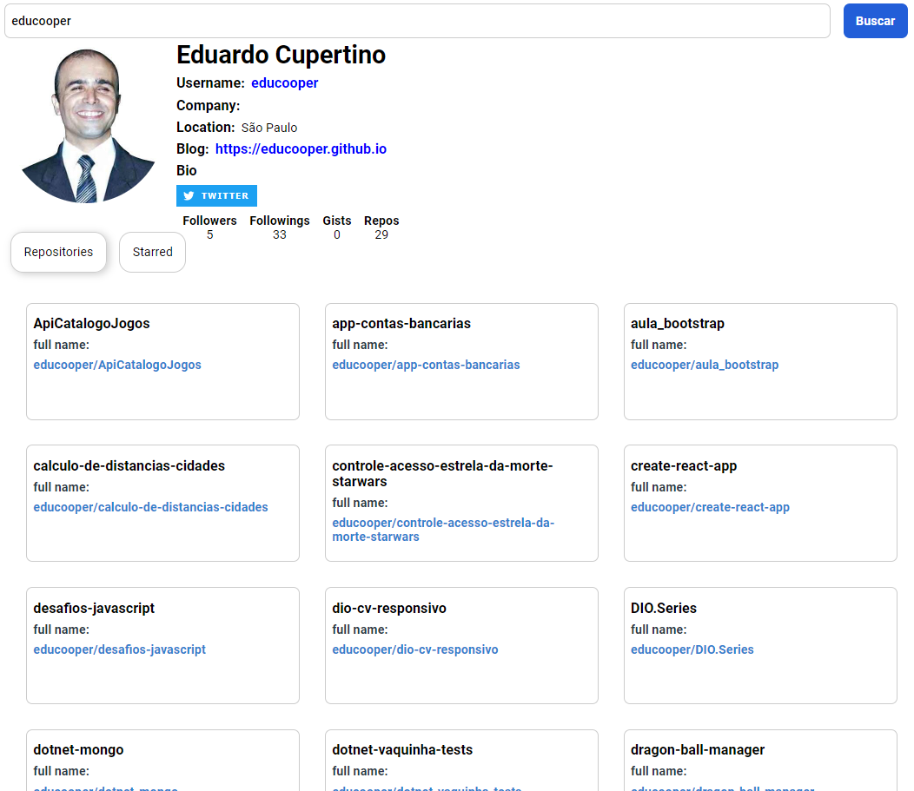

<h1 align="center">Project - Interface from GitHub API with React JS</h1>

<p align="center">
   
  
 


<hr>


<p align="center">
  <a href="#dart-about">About</a> &#xa0; | &#xa0; 
  <!-- <a href="#sparkles-features">Features</a> &#xa0; | &#xa0; -->
  <a href="#rocket-technologies">Technologies</a> &#xa0; | &#xa0;
  <a href="#white_check_mark-requirements">Requirements</a> &#xa0; | &#xa0;
  <a href="#checkered_flag-starting">Starting</a> &#xa0; | &#xa0;
  <!-- <a href="#memo-license">License</a> &#xa0; | &#xa0; -->
  <a href="https://github.com/educooper" target="_blank">Author</a>
</p>


<br>

## :dart: About ##

In this project we consumn a public github API to recreate a new interface, creating a frontend application with reusable components, using the best pratics on reactJS technology were, has used props, arrow functions and a little bit more.





## :rocket: Technologies ##

- [axios](https://www.npmjs.com/package/axios)
- [react-tabs](https://www.npmjs.com/package/react-tabs)
- [styled-components](https://styled-components.com/)

## :white_check_mark: Requirements ##

Get Starting :checkered_flag:, you need to install [Git](https://git-scm.com) and [node.js](https://nodejs.org/).

## :checkered_flag: Starting ##

```bash
# Create a new local app
$ npx create-react-app git-api-interface-reactjs

# Clone this project
$ git clone https://github.com/educooper/git-api-interface-reactjs

# Acess it
$ cd git-api-interface-reactjs

# Make a reindex
$ npm I

# Execute the project
$ npm start

or

$ yarn start

Access it on [http://localhost:3000](http://localhost:3000)

```

## :coffee: Addicional Features

BIO accomplished, funcional twitter button and finally, Link from each repository to the correct github repository: 


```js
            <S.WrapperList>
              {githubState.repositories.map((item) => (
                <RepositoryItem
                  key={item.id}
                  name={item.name}
                  linkToRepo={`https://github.com/`+item.full_name}
                  fullName={item.full_name}
                />
              ))}
            </S.WrapperList>
```


Thanks very munch [Digital Innovation One](https://web.digitalinnovation.one/) for this great opportunity!

<a href="#top">Back to the Top</a>
